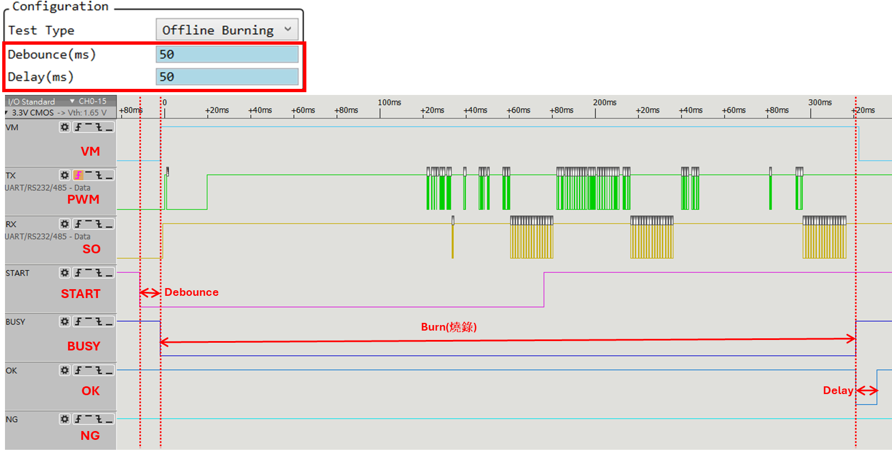

# 離線燒錄

## 設定離線燒錄步驟

1. `設定參數`
  - 選擇 Offline Burn
  - 必要時,調整 Debounce, Delay time

2. `寫入Register`
  - 選擇燒錄檔寫入燒錄器

3. `設定燒錄器`
  - 將燒錄設定寫入燒錄器

Note: 
不做離線燒錄時, `Test Type` 設回`None`,避免按鍵誤動作

## 燒錄機台硬體設定

Note: 可按下`SW1`模擬`START`信號

