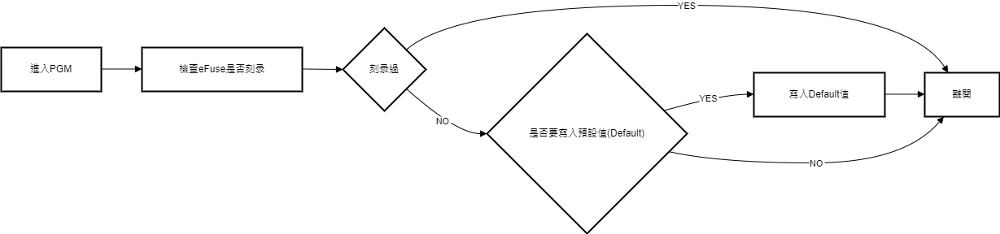
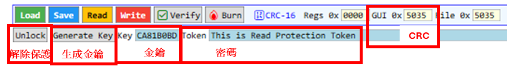
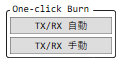

# GmtTestTool

## APP功能描述

### 第一次启动

---
<mark>第一次启动程序会要求选择芯片</mark>

### 编程模式(PGM)

---

- 若检测到eFuse未刻录过会问你是否要写入Default值
 `YES` => 写入Default值到Register

- 若测到eFuse刻录过,需要密碼才能讀取芯片

### 芯片讀取保護

---

- 燒錄時`密碼+暫存器CRC`會生成一個金鑰.此金鑰和密碼須妥善保存供日後讀取芯片使用
- 若芯片燒錄過,需要此`密碼+金鑰`正確才能讀取燒錄內容及暫存器

### 刻录

---

#### 一般功能

- `One`

  烧录一个Byte : 刻录指定的Register.

- `All`

  烧录全部16个Register.

- `验证`

  验证刻录的值是否符合GUI值.

- `Set Zero`

  将全部缓存器设为0.

- `Set Default`

  将全部缓存器设为默认值.

- `Reload`

  载入eFuse值到Register.不会自动读出Register到GUI.

#### 一键刻录

- 新治具的TX/RX可自動切換 -> 選`TX/RX自動`
- 舊治具的TX/RX需手動切換 -> 選`TX/RX手動`

## 離線燒錄

➡️[Oflline Programming](Oflline_Programming.md)

---

## APP 更新下载

### 下载

**点击[Gitee](https://gitee.com/billwang168/gmt-test-tool)页面右侧[发行版](https://gitee.com/billwang168/gmt-test-tool/releases)下载更新**

### 检查/下载更新

## 韧体手动更新

Feel free to ping us for questions:
 [bill.wang@gmt.com.tw](mailto:bill.wang@gmt.com.tw)
