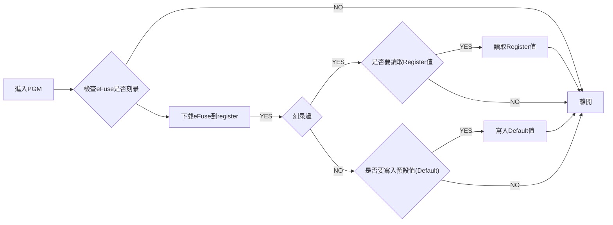

# GmtTestTool

## APP功能描述

### 第一次启动

<mark>第一次启动程序会要求选择芯片</mark>


### 编程模式(PGM)




<mark>PGM Mode下,若Load File时改变了TX/RX反相相关设定时会离开PGM Mode</mark>

- 进入PGM后会问你要不要做eFuse刻录与否的检测?
  `Yes` => 下载eFuse到register


- 若检测到eFuse未刻录过会问你是否要写入Default值
 `YES` => 写入Default值到Register


- 若测到eFuse刻录过会问你是否要读出Register值


### 刻录

#### 一般功能


- `One`

  烧录一个Byte : 刻录指定的Register.

- `All`

  烧录全部16个Register.

- `验证`

  验证刻录的值是否符合GUI值.

- `Set Zero`

  将全部缓存器设为0.

- `Set Default`

  将全部缓存器设为默认值.

- `Reload`

  载入eFuse值到Register.不会自动读出Register到GUI.

#### 一键刻录流程

<mark>需先设定RXTX极姓</mark>

```text
[GUI]進入PGM
  ↓
[GUI]设定GUI的TX(PWM)/RX(SO)极性,如下图设定
  ↓
[GUI]按下Burn  
  ↓
[USER]手动改变刻录板的TX(PWM)/RX(SO)极性
  ↓
[程式]执行刻录
  ↓
[程式]验证刻录是否成功
  ↓
[程式]离开PGM
```

- **CMD/SO反相**


- **CMD/SO无反相**


## APP 更新下载

### 下载

**点击[Gitee](https://gitee.com/billwang168/gmt-test-tool)页面右侧[发行版](https://gitee.com/billwang168/gmt-test-tool/releases)下载更新**


### 检查/下载更新


## 韧体手动更新


