# GmtTestTool

## APP功能描述

### 第一次启动程序会要求选择芯片

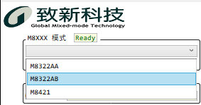

### Pragramming Mode(PGM)

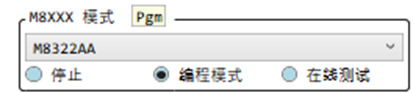

<mark>PGM Mode下,若Load File時改變了TX/RX反相相關設定時會離開PGM Mode</mark>

- 進入PGM後會問你要不要做eFuse燒錄與否的檢測?
  `Yes` => 下載eFuse到register

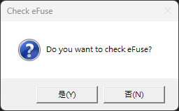

- 若檢測到eFuse未燒錄過會問你是否要寫入Default值
 `YES` => 寫入Default值到Register

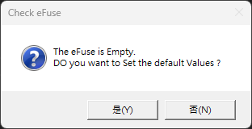

- 若測到eFuse燒錄過會問你是否要讀出Register值

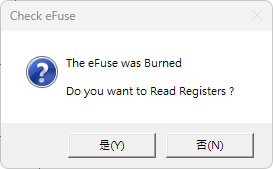

### 燒錄功能

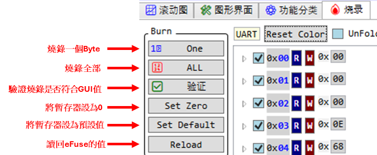

- `One`烧录一个Byte : 燒錄指定的Register.
- `All`烧录全部16個Register.
- `验证`验证刻录的值是否符合GUI值.
- `Set Zero`将全部缓存器设为0.
- `Set Default`将全部缓存器设为默认值.
- `Reload`載入eFuse值到Register.不會自動讀出Register到GUI.

#### 一键刻录

<mark>需先設定RXTX極姓</mark>

- **CMD/SO反相**

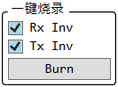

- **CMD/SO无反相**

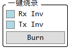

## APP 更新下载

### 下载

**點擊[Gitee](https://gitee.com/billwang168/gmt-test-tool)頁面右側[發行版](https://gitee.com/billwang168/gmt-test-tool/releases)下載更新**

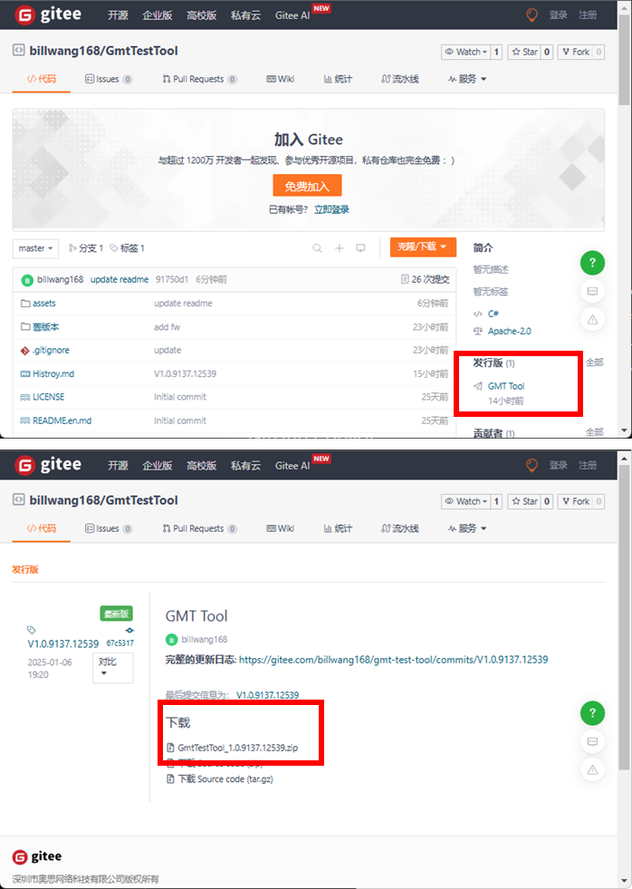

### 检查/下載更新

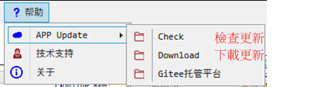

## 韧体手动更新

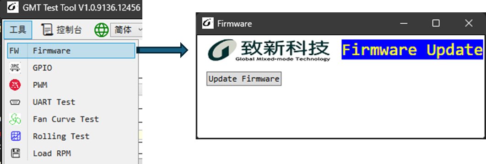
